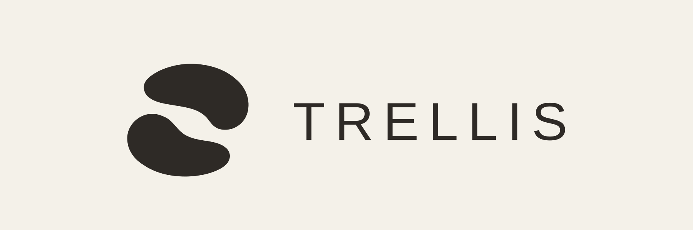

# Trellis

Trellis is a local-first kanban board and vault whose primary caller is an AI agent, not a human at a terminal. It stores boards, cards and entry metadata in a SQLite database and provides a command-line interface for reading, creating, and modifying them.

## Storage

Trellis keeps its state in `TRELLIS_HOME` (environment variable), defaulting to `~/.trellis` on Unix and `%LOCALAPPDATA%\trellis` on Windows. Cards and metadata are in `TRELLIS_HOME/trellis.db`. Entry Markdown, artifacts, and derived vector indexes are kept per project, and promoted entries in the global vault:

```text
TRELLIS_HOME/
  trellis.db
  projects/<project-key>/
    vault/
    artifacts/
    vectors.db
  global/
    vault/
```

Entry and artifact files are the source of truth for their content; SQLite stores metadata, relationships, and search indexes, never artifact bytes. A project is a virtual namespace; a committed .trellis marker binds a directory to it.

## Install

Linux and macOS:

```bash
curl -fsSL https://raw.githubusercontent.com/mtch3n/trellis/main/install.sh | sh
```

This downloads the release for your platform and installs it to
`~/.local/bin/trellis`. Set `TRELLIS_INSTALL_DIR` to install elsewhere, or
`TRELLIS_VERSION` to pin a version instead of taking the latest.

On Windows, or to install by hand, download the archive for your platform from
[the latest release](https://github.com/mtch3n/trellis/releases/latest),
extract `trellis`, and put it on your `PATH`.

Once installed, Trellis keeps itself current:

```bash
trellis version          # print the installed version
trellis update --check   # report whether a newer release exists
trellis update           # download and install the latest release
trellis update --force   # reinstall the current release without prompting
```

`trellis update` asks before replacing the binary and does nothing when you are
already on the latest release. `trellis update --force` skips both: it
reinstalls even when the versions match, which repairs a damaged or partially
written install. Re-running the install script has the same effect.

## Commands

**Init**
```bash
trellis init              # Mark this directory with a project (commit the .trellis it writes)
trellis project merge API --into MONO            # print what a merge would do
trellis project merge API --into MONO --apply    # back up, merge, rewrite markers
```

**Interactive terminal**
```bash
trellis tui              # Start explicitly in an interactive terminal
trellis tui --board main # Select a board at startup
```

The terminal workspace is a full-screen interface: a sidebar for switching
between the Boards, Vault and Events views, board columns as scrollable lanes,
and a preview pane for the selected card or entry. The layout adapts to the
terminal size, dropping the sidebar and preview on narrow windows.

A command bar sits at the bottom. Use `/board` to refresh cards, `/boards` to
list boards, `/board <name>` to switch, `/new <title>` to create, `/show <card>`
to read, `/move <card> <column>` to move, and `/comment <card> <text>` to add a
comment. `/title` and `/body` edit cards after `/show`, with version-conflict
protection. Use literal `\n` in `/body` for line breaks. Plain text or
`/search <query>` searches project cards and entries. Tab completes commands
and Up/Down walks history. `/help` lists everything; `/quit` or Ctrl-C exits.

The TUI requires a terminal (no pipes or `--json`), uses existing local storage,
and needs no daemon or AI provider. It starts only with `trellis tui`.

**Cards**
```bash
trellis card new --title "Task" --priority high
trellis card ls           # List all cards in the current board
trellis card show 1       # Show card by sequence number
trellis card move 1 done  # Move card to a column
trellis card edit 1 --title "Renamed" --if-version 2
trellis card rm 2         # Delete a card
```

**Boards**
```bash
trellis board ls          # List all boards in this project
trellis board new --name refactor
trellis board default main  # Set the default board
```

**Columns**
```bash
trellis column ls         # List columns in the current board
```

**Artifacts**
```bash
trellis artifact add screenshot.png --card 12
trellis artifact link screenshot.png --card 12      # by name, or /KEY/artifacts/<name>
trellis artifact ls --card 12
```

Every object has an address: `/KEY/boards/<slug>`, `/KEY/cards/KEY-12`,
`/KEY/vault/<slug>`, `/GLOBAL/vault/<slug>` and `/KEY/artifacts/<name>`. Any
command that takes a ref also takes an address, and an address acts in its own
project from any directory.

Artifacts accept images, PDFs, text, audio, video, and common archives. The
file is copied under the project directory; its bytes are not stored in the
database.

**Storage maintenance**
```bash
trellis maintenance prune --before 90d --events --invocations
trellis maintenance compact
trellis vector prune
trellis vector compact
trellis backup prune ~/.trellis/backups --keep 5
```

Maintenance is explicit. Event pruning should only be used after any external
event consumers have advanced beyond the selected cutoff.

**UI and daemon**

```bash
trellis ui                 # print where the UI is, or serve it here
trellis daemon             # serve UI, API, and local CLI IPC in the foreground
trellis daemon install     # start it automatically at login
trellis daemon start       # start it in the background
trellis daemon stop
trellis daemon restart
trellis daemon status      # running? on what? supervised by what?
trellis daemon uninstall   # stop it and remove the service
```

`install` writes a systemd user unit on Linux or a LaunchAgent on macOS; it is
not supported on Windows, where `daemon start` still runs the daemon as a
background process. Add `--linger` on Linux to keep the daemon running while
you are logged out. `start`, `stop` and `restart` detect which of the two is in
play, so the same commands work whether or not you have installed the service.

The web UI is on unless you turn it off. Set `ui.enabled: false` in the config
file to run an IPC-only daemon that binds no TCP port: agents still share one
database, search index and claim clock, and nothing is reachable over HTTP.

The default UI address is `http://127.0.0.1:7788`. Set `ui.port` and `ui.bind`
to change it, then run `trellis daemon install` again so the service picks up
the new address. `trellis ui` never starts a second server: when a daemon is
already serving the UI -- the normal case once the service is installed -- it
prints that address and exits.

**Diagnostics**

```bash
trellis doctor        # check binary, storage, database, config, daemon, search
trellis doctor --json # same report as structured checks with fix commands
```

`doctor` exits 1 when a check fails and 0 when everything is `ok` or `warn`.
Each check carries the command that resolves it.

## Agent plugins

Trellis ships one plugin that works in both Claude Code and Codex. It adds the
skills that teach the workflow, plus three hooks: `SessionStart` injects the
current board state and the agent's identity, `UserPromptSubmit` recalls the
refs bearing on a prompt, and `Stop` warns when the agent has claimed cards it
never commented on.

Both runtimes need `trellis` on their `PATH` (see [Install](#install)) and
Python 3 for the hooks. On Windows, run the harness from WSL or another POSIX
shell.

### Claude Code

```
/plugin marketplace add mtch3n/trellis
/plugin install trellis@trellis
```

The same commands work from a terminal as `claude plugin marketplace add ...`
and `claude plugin install ...`. To run against a checkout instead, use
`claude --plugin-dir ./plugin`.

### Codex

```bash
codex plugin marketplace add mtch3n/trellis --ref main
codex plugin add trellis@trellis
```

Then open `/hooks` in Codex and trust the Trellis hooks. Installing does not
trust them, and until they are trusted the board context never appears.

### After installing

Start a new session: hooks are read at session start, so an existing session
will not pick up a freshly installed plugin. Verify with
`claude plugin details trellis@trellis` or `codex plugin list`.

To install from a local checkout in either runtime, point the marketplace at
the repository root rather than at `plugin/`:

```bash
codex plugin marketplace add /path/to/trellis
```

### How the hooks behave

`SessionStart` supplies board context on startup, resume, clear, and
compaction. The session ID determines the Trellis identity: Claude Code
persists it through `CLAUDE_ENV_FILE`, while Codex receives an explicit
`TRELLIS_AGENT=...` assignment in context that the skill uses for each CLI
call.

`Stop` shows a non-blocking notice when the current actor has claimed cards
with no comment. It does not force a continuation, write comments, release
cards, or mark work done. Notices may recur until the claimed work has a
comment. Parallel workers still need distinct actor suffixes; the root stop
hook does not aggregate their cards.

The Claude Code manifest is `.claude-plugin/marketplace.json` at the repository
root, pointing at `plugin/`; the Codex manifest is
`plugin/.codex-plugin/plugin.json`. Both share the skills under
`plugin/skills/` and the hooks at `plugin/hooks/hooks.json`.

## Browser verification

Run `scripts/ui-browser-smoke.sh` to build the embedded frontend, create an
isolated temporary project, and verify the P3 board/SSE flows and P5 vault,
graph, label-merge, Markdown preview, and claim-steal flows in Chromium.

## Exit Codes

| Code | Meaning | Example |
|------|---------|---------|
| 0    | Success | Any successful command |
| 2    | Usage error | Missing required flag |
| 3    | Not found | Card ID does not exist |
| 4    | Conflict | Card changed since last read |
| 5    | Policy | Action violates board rules |

## Chat in the web UI

The web UI can chat with a model about the project you have open. Open the chat
from the shell's chat button or with `Ctrl .`; it docks beside the board. It
reads the board and vault, and changes cards when you ask it to. Its writes are
recorded as `agent:chat-<provider id>`.

Add providers in Settings › Providers. They are saved under `ai` in
`config.yaml`:

```yaml
ai:
  default_provider: work
  providers:
    - id: work
      kind: azure              # openai, azure, anthropic, google, openai-compatible
      base_url: https://<resource>.openai.azure.com/openai/v1
      model: gpt-5             # the deployment name for Azure
      api_key_env: AZURE_API_KEY   # overrides api_key when set for the daemon
      effort: medium           # low, medium, high or xhigh; empty is the model's own
    - id: claude
      kind: claude-code        # or codex: a local agent the daemon runs
      model: sonnet
      dir: ~/code              # the directory it starts in
```

An API provider runs on the Vercel AI SDK in the browser. Its requests go
through the daemon, which adds the key, so the key never reaches the browser.
A local agent (Claude Code or Codex) runs in the daemon with `TRELLIS_PROJECT`
set, and works the board through the `trellis` CLI. Claude Code may run only
`trellis` and read files; Codex runs in its workspace-write sandbox, which may
also write the Trellis store.

## Optional vector search

Vector search is disabled by default. Configure an external embedding
executable as a project override (it reads text on stdin and prints a JSON
float array) and choose `fts`, `vector`, or `hybrid` search:

```bash
trellis config set search.vector.enabled true
trellis config set search.vector.provider command # command, http, or local
trellis config set search.vector.embed_command /path/to/embedder
trellis config set search.vector.dimension 1024
trellis config set search.method hybrid
trellis vector rebuild
trellis vector status
```

Entry bodies are automatically chunked and reconciled after create/edit/delete
writes. `local` uses an Ollama-compatible local endpoint by default; `http`
uses an OpenAI-compatible `/v1/embeddings`-style endpoint. Set
`search.vector.chunk_size` and `search.vector.chunk_overlap` to tune chunks.

The vector index is derived state. Use `trellis vector prune` to drop the
vectors whose entry has left the vault, and `trellis vector reindex` to
invalidate the persisted extension cache so it is rebuilt on the next vector
query. FTS5 remains available when the vector provider is disabled or
unavailable.

### Daemon and local IPC

The daemon is explicit; ordinary CLI commands do not start it or require it:

```bash
trellis daemon
trellis search "deployment failure" --daemon
```

Installing it as a login service (`trellis daemon install`) makes it implicit
for the user without making it implicit for the CLI: commands still work when
it is down.

The browser UI uses localhost HTTP. CLI, plugin, and agent clients use the
versioned local JSON protocol instead: a permissioned Unix socket on macOS and
Linux, and a user-private loopback endpoint file on Windows. The daemon owns a
single-instance lock, while direct CLI mode remains available when it is not
running.

## Development

Building from source needs Go 1.27 and, for the embedded web UI, pnpm.

```bash
make build   # audit the frontend and build bin/trellis
make test    # go test ./...
make lint    # go vet and frontend linting
```

`make` is for working on Trellis. To install it, use the release script above.
